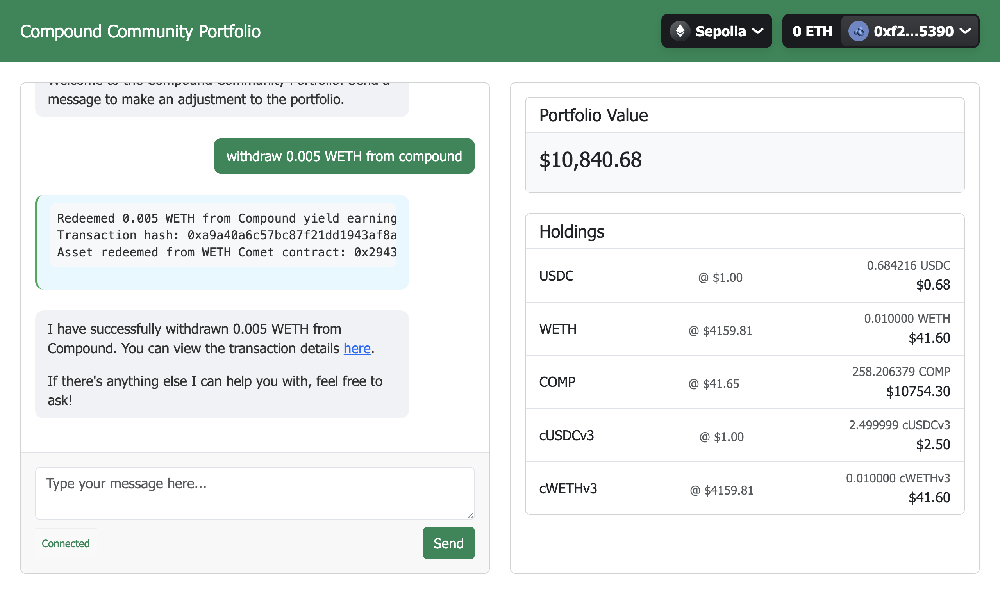

# Compound Assistant Python Template

A [LangGraph](https://github.com/langchain-ai/langgraph) and [Coinbase AgentKit](https://github.com/coinbase/agentkit) powered assistant for interacting with the [Compound Finance](https://compound.finance/) on the blockchain.

## Overview
This is a template for developers looking to build an assistant that can interact with the Compound Finance on the blockchain. It consists of a backend server and a frontend client that can be run locally or deployed to the cloud. 

### Preview


## System Architecture


## Code Architecture


You can find a sample agent prompt in the `backend/compound_assistant/config/agent.yaml` file.

## Requirements
- Python 3.10+
- Poetry for package management and tooling
  - [Poetry Installation Instructions](https://python-poetry.org/docs/#installation)
- [OpenAI API Key](https://platform.openai.com/docs/quickstart#create-and-export-an-api-key)
- Private Key for the EVM account you want the assistant to use
- Node.js 18+ and npm for the frontend

Additionally, Docker Compose can be used to run the application in a containerized environment, without these dependencies.

## Running the Compound Assistant
### From Shell

The application consists of a backend server and a frontend client that need to be run in separate terminal windows:

#### Shell 1: Backend Setup
```bash
cd backend
cp .env.example .env  # Create and edit with your credentials
poetry install
poetry run python server.py
```

#### Shell 2: Frontend Setup
```bash
cd frontend
npm install
npm start
```

The frontend will be available at http://localhost:3000, and it will connect to the backend running on http://localhost:8000.

Connect your wallet using the button in the navigation bar to start interacting with the assistant. 

### From Docker

```bash
docker compose up
```

This will start the backend server and the frontend client. The frontend will be available at http://localhost:3000, and it will connect to the backend running on http://localhost:8000.

# Funded by Compound Grants Program
Compound Assistant is funded by the Compound Grants Program. Learn more about the Grant on Questbook [here](https://new.questbook.app/dashboard/?role=builder&chainId=10&proposalId=678c218180bdbe26619c3ae8&grantId=66f29bb58868f5130abc054d). For support, please reach out the owner of this repository: @mikeghen.