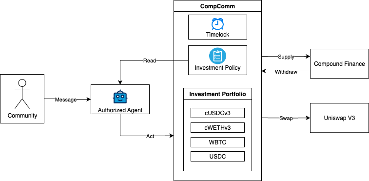
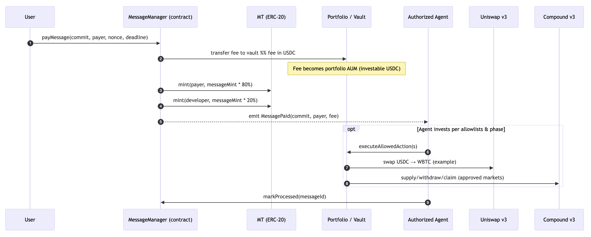
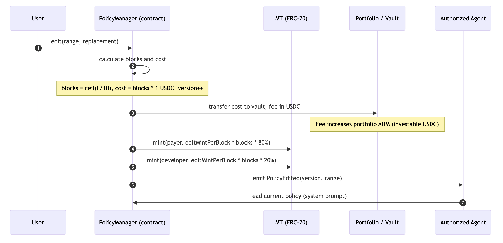

# Compound Community Portfolio (CompComm): Pay‑to‑Govern (P2G) Experiment

Hello Compound Community \:wave:

I’m excited to share a new experiment I’ve been building: **Compound Community Portfolio (CompComm)**. This is a community‑managed portfolio that **doesn’t use token voting**. Instead, it pilots a **Pay‑to‑Govern (P2G)** model where anyone can pay to send messages (proposals) or pay to edit the on‑chain policy that guides execution. Those payments go straight into the portfolio, and contributors receive a **Management Token (MT)** that redeems pro‑rata for WETH from the portfolio at its **terminal  state.**

This work is a natural extension of my earlier CGP project, *[Compound Actions for Coinbase AgentKit](https://www.comp.xyz/t/compound-actions-for-coinbase-agentkit/6314)*, where I introduced messaging with an AI agent working from a policy (system prompt) to make portfolio decisions. CompComm takes that same foundation and applies it to decentralized portfolio management and governance.

## What is CompComm?

CompComm is a minimal, non‑upgradeable on‑chain portfolio with three main parts:

* **Priced Inputs:** pay‑per‑message (user prompts) and pay‑per‑policy‑edit (system prompt). Payments are in **USDC** and increase AUM for the portfolio.
* **Claim‑Bearing Issuance:** each paid input **mints MT** deterministically; holders later redeem pro‑rata in **WETH** after the consolidation phase. There is no premine.
* **Bounded Execution:** an **authorized agent** can only execute within **allowlists** (Compound v3 / Uniswap v3) and a fixed **timelock** that drives the lifecycle: *Contribution → Consolidation → Redemption* in WETH.

_Figure 1: CompComm Architecture_

## Why Pay‑to‑Govern (P2G)?

DAO governance often struggles with two extremes:

* **Noise or spam** when participation is free or cheap.
* **Plutocracy** when governance relies on token voting, concentrating power in a few whales.

P2G flips the model:

* Paying to govern filters out low‑signal proposals.
* Every governance action grows the portfolio itself by adding investable USDC.
* MT issuance is strictly tied to these payments, ensuring influence is always backed by real value and issued ONLY to individuals providing that value.

In short: you don’t buy governance power up front, instead you **pay to govern** and earn a claim on the terminal portfolio in return.

## How it Works in this Experiment

### 1. Message Flow (User Prompts)

* Pay a fixed 10 USDC fee per message (user prompt)
* Vault receives the fee, increasing the AUM of the portfolio
* 1 MT is minted to the payer and 0.2 MT to the dev treasury, `MessagePaid` event emitted
* Authorized agent will act (supply/withdraw on Comet; swap via Uniswap v3) based on the current policy (system prompt)

_Figure 2: Message Flow_

### 2. Policy Evolution (System Prompt)

* Pay 1 USDC per 10 characters changed to edit the on‑chain investment policy.
* Each 10 characters changed mints MT (1 MT to payer / 0.2 MT to dev treasury), policy version increments
* Policy is updated, Agent will act based on the new policy (system prompt) in the next message

_Figure 3: Policy Evolution_

### 3. Lifecycle & Guardrails
The authorized agent will be an AI agent running using Coinbase's AgentKit. It will be reading the policy from on-chain each new message as it's system prompt before acting. AUM in the portfolio will be timelocked for 18 months, then consolidated to WETH, and finally redeemable by MT holders. The agent will not be able to perform transfers, only allowlisted actions. 

* **Contribution (pre‑unlock):** allowlisted actions only. Allow actions are: 
  * Compound Supply and Withdraw to allowlisted Comet contracts
  * Uniswap Swap between allowlisted tokens
* **Consolidation (post‑unlock):** anyone can unwind positions to WETH.
  * Only allows Compound withdraws and swaps to WETH.
* **Redemption:** burn MT for pro‑rata WETH.
  * Only allowed after the timelock period and when the portfolio is consolidated to WETH.

## A Note on Funding (the 80/20 split)

Each mint event mints an additional 20% MT to the dev treasury multisig. My intent is to use this 20% as lightweight funding for the experiment (ops, infra, audits). In practice, it’s not strictly necessary, the dev share could be set to 0% or funded through other means like grants. Notably, this dev share would only be redeemable for value when the terminal state of the portfolio is reached or a market for MT tokens is established.

## How this Extends Previous Work

This experiment directly builds on my CGP‑funded work, *[Compound Actions for Coinbase AgentKit](https://www.comp.xyz/t/compound-actions-for-coinbase-agentkit/6314)*. There, I built the pre‑built Supply, Borrow, Repay, and Withdraw actions and signed messaging flows. CompComm applies that same surface—priced inputs → signed intents → bounded execution—to the governance of community portfolios. I'm currently building Agentkit actions for Uniswap V3 which really makes this more interesting. 

## What Success Looks Like

* A steady flow of **paid messages and policy edits** that both fund the portfolio and surface higher‑signal governance inputs.
* **On‑chain observability** of backlog, actions, and policy versions, enabling dashboards and audits.
* At unlock, a clean **consolidation to WETH** and **pro‑rata redemption** for MT holders.
* A thriving CompComm community on telegram. Join us here:  

## Feedback Welcome

* Does **P2G** feel like a healthier alternative to coin voting for community managed portfolios?
* Any strong views on the **20% developer share**?
    * Again, this share would only be redeemable for value when the terminal state of the portfolio is reached after 18 months or a market for MT tokens is established.
* Which assets/markets should be on the initial **allowlists** for Compound v3 and Uniswap v3?
    * This will be on Base so I think all the assets on Compound would be allowed, but I'm not sure about the Uniswap v3 assets.
* Is there any interest in an initial **crowdsale of Management Tokens** to help me fund this experiment? 
    * I was thinking a presale at a 50% discount, so 5 USDC per MT, because it will be 10 USDC to mint 1 MT after it goes live.

Looking forward to the discussion! I've set up a Telegram group if you're interested in chatting more about it there: https://t.me/+IlieVKFBCU9iMGNh

— Mike
