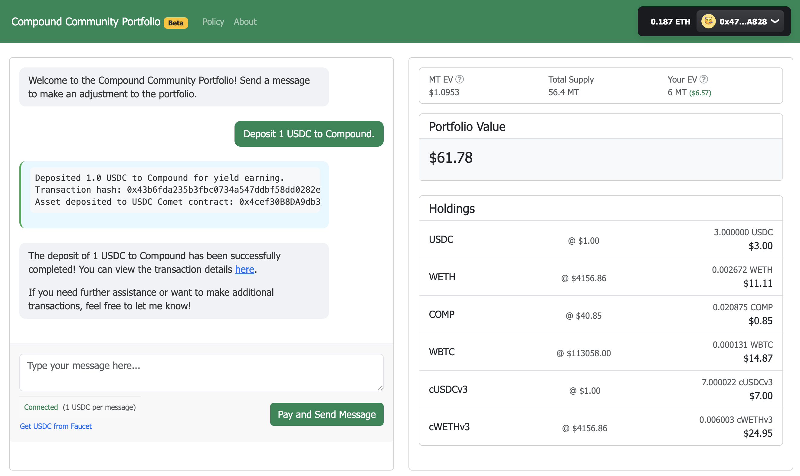
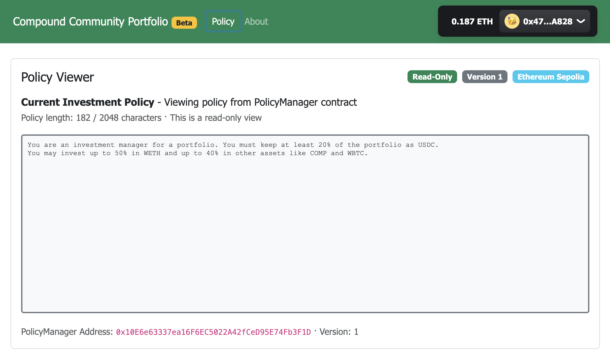
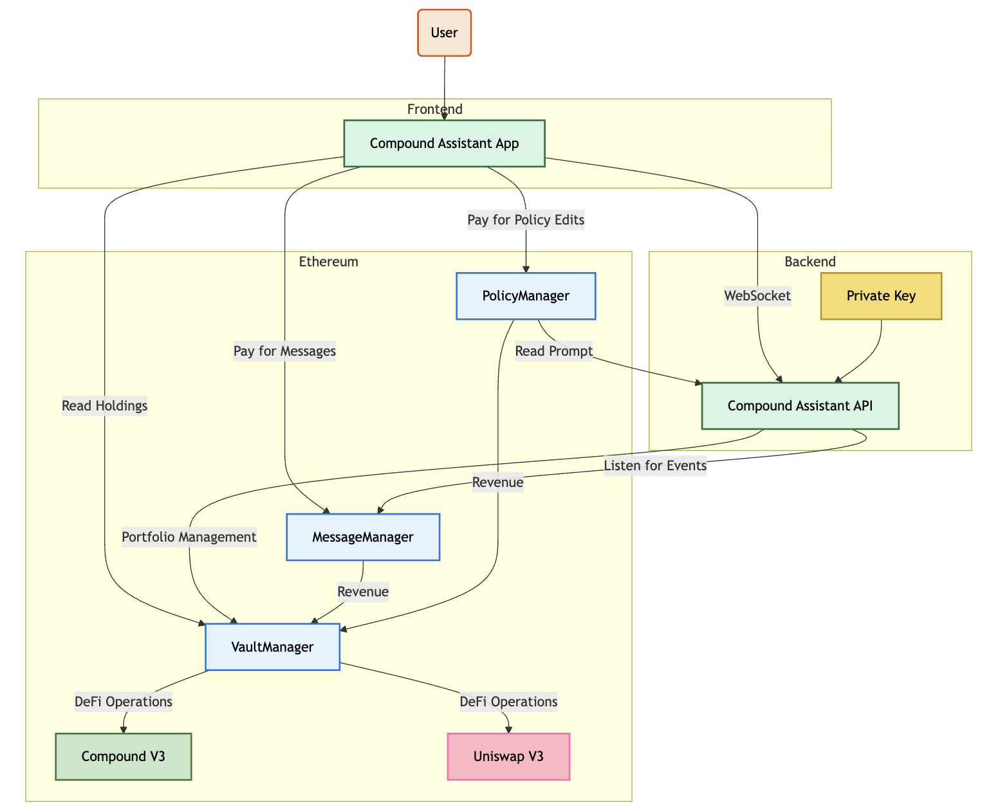
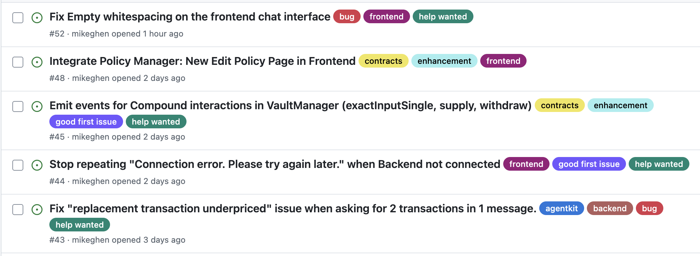

## Sepolia beta is live + call for testers

**TL;DR**: The Community Portfolio is now live on **Sepolia** for public testing at https://compcomm.club. You'll need **Sepolia ETH** (for gas) and **testnet USDC** which you can get ≈3 USDC/day from the Compound faucet link inside the app. Simple swaps/withdrawals work today; multi‑step messages also work but may occasionally hit a "replacement transaction underpriced" nonce issue that I'm fixing in Agentkit. Code is fully open‑sourced (frontend, backend, and new contracts) with a **3‑layer security model** to keep the funds in the portfolio safe. Early test economics look interesting: MT is currently valued at **$1.091 (in ETH at terminal)**; each message mints **1 MT** to the user (+0.2 MT to dev), so there's a small positive EV on testnet.

### CompComm.Club Preview

#### Chat Preview


#### Policy Preview


### Try it now on Ethereum Sepolia Testnet

* **App:** [https://compcomm.club](https://compcomm.club)
* **Code:** [https://github.com/mikeghen/comp-comm-portfolio](https://github.com/mikeghen/comp-comm-portfolio)


**What you'll need**

1. **Sepolia ETH** (for gas) - use any Sepolia ETH faucet.
2. **Testnet USDC** - in‑app link to the **Compound Faucet** (≈**3 USDC/day**).

**How to test (quick start)**

1. Connect your wallet to **Sepolia** at [https://compcomm.club](https://compcomm.club).
2. Use the app link to top up **testnet USDC**.
3. Send a message to the agent. Examples:

   ```
   Swap 1 USDC to COMP
   Swap 0.001 WETH to WBTC
   Withdraw 1 USDC from Compound
   Withdraw 1 USDC from Compound and swap it for WETH
   ```
4. Watch the resulting transactions and your **MT** balance update.

Multi‑op messages may sporadically hit _"replacement transaction underpriced"_ due to nonce handling. I'm updating the Agentkit actions to improve nonce management; feel free to stress‑test and report when you hit it (tx hash, steps, and timestamps help a lot).

### Call for Beta Testers

I'm looking for folks to try some of the simple interactions above and also try multi‑operation messages. The more real‑world phrasing and edge cases, the better. 

If you do give it a try, please share if you have any issues or errors:

* the exact message you sent,
* your expected outcome,
* what happened (tx hashes, screenshots),
* and any UI/UX rough edges.

**Open issues** to help me triage the issue and if you want to contribute, **PRs are welcome in the repo**.

### Shout‑outs to the Contributors

Part of the grant required **2** additional dev contributions - we're lucky to have **3** already:

* **@fawarano** - added an **About** page to the `compound-assistant` template that this project builds on: [https://github.com/fawarano](https://github.com/fawarano)
* **@deluxeRaph** - contributed to the **MessageManager** smart contract in this repo: [https://github.com/deluxeRaph](https://github.com/deluxeRaph)
* **@johhonn** - contract review, resolved a critical issue, and delivered **gas optimizations** for onchain policy edits: [https://github.com/johhonn](https://github.com/johhonn)

Big thanks to all three - exactly the kind of collaboration this experiment is meant to spark.

### Codebase Published to Github 🚀
You can find the codebase for this project in the [Compound Community Portfolio Github repo](https://github.com/mikeghen/comp-comm-portfolio).  The repo now includes:

* a modified **frontend** for composing and publishing messages onchain,
* a **backend** agent that reads messages from chain and executes allowed operations, and
* brand‑new **MessageManager / VaultManager** contracts that demonstrate a **secure agent system** end‑to‑end.

### Security Model to prevent rug pulls 🛡️


I this section I highlight one of the core contributions of this project: a security model for agnet-managed portfolios to prevent rug pulls. It takes a 3-layer approach to security:

1. **Onchain‑first messaging & payment**

   * The frontend **publishes messages to the blockchain**.
   * The backend **only** reads messages **from chain** and will **only** process messages **paid via MessageManager**.
   * The backend no longer accepts messages from a web endpoint - the chain enforces validity and payment before any processing.

2. **Strictly scoped agent tools**

   * The backend agent is only given tools for operations **on the VaultManager** (the onchain portfolio).
   * **No generic transfer tools** are given to the agent, removing the possibility of tricking the agent into arbitrary sends.
   * The agent itself also doesn't hold any significant amount of funds, just the gas required to execute the actions.

3. **Vault constraints at the contract level**

   * A single **withdraw path**: **MT redemption**, which is timelocked, physically prevents the agent from withdrawing funds from the vault.
   * **Asset allowlist** for swaps prevents interaction with malicious tokens sent to the vault.
   * **Action allowlists** (e.g., **Uniswap** and **Compound**) and an allowlist of **Compound Comet** markets.

Because anyone can message the agent, the system is designed so that **"hack attempts" can't rug funds**; they'll just end up paying the fee and **adding 10 USDC per attempt** to the portfolio (on testnet), while messages that violate security policy (and onchain investment policy) simply won't execute.


### Beta‑test economics 💰
Current **MT redeemable value** (terminal, in ETH): **$1.091**. Each valid message costs **1 USDC** and mints **1 MT** to the sender (**+0.2 MT** to the developer).

* This implies a small positive **expected value ≈ $1.09**, before accounting for dilution from the **1.2 MT** total minted per interaction.
* Example to date: **45 interactions** yields **54 MT** total supply. One of my test wallets made **5 interactions** and currently shows **5 MT (~$5.45)**, i.e., **+9%** so far for my participation.

This is **testnet**; token prices can deviate from mainnet and may fluctuate. Treat the economics as an experiment to explore **pay‑to‑govern** dynamics rather than a promise of returns.


### What's next 🔜

* Ship the Agentkit nonce‑handling update to eliminate underpriced replacement errors allowing for more complex messages.
* Collect feedback from testers to refine prompts, UI, and action ergonomics.
* Continue to address a growing list of open isssues and encouraging open source contributions by adding **help wanted** labels to the issues. I have found in the past that adding "help wanted" labels to issues has led to a significant increase in contributions from the OS community on Github.



### Feedback Welcome

Questions, bugs, or ideas? Drop them in this thread or open an issue/PR: [https://github.com/mikeghen/comp-comm-portfolio](https://github.com/mikeghen/comp-comm-portfolio). Thanks for testing!
