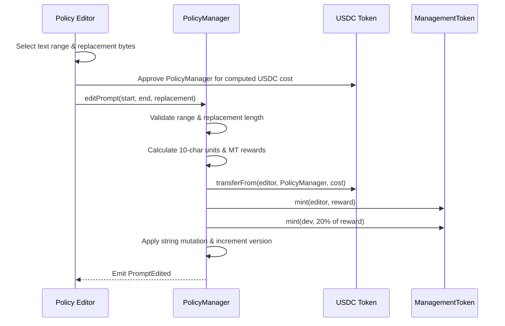

```mermaid
sequenceDiagram
    participant Editor as Policy Editor
    participant PolicyMgr as PolicyManager
    participant USDC as USDC Token
    participant MT as ManagementToken

    Editor->>Editor: Select text range & replacement bytes
    Editor->>USDC: Approve PolicyManager for computed USDC cost
    Editor->>PolicyMgr: editPrompt(start, end, replacement)
    PolicyMgr->>PolicyMgr: Validate range & replacement length
    PolicyMgr->>PolicyMgr: Calculate 10-char units & MT rewards
    PolicyMgr->>USDC: transferFrom(editor, PolicyManager, cost)
    PolicyMgr->>MT: mint(editor, reward)
    PolicyMgr->>MT: mint(dev, 20% of reward)
    PolicyMgr->>PolicyMgr: Apply string mutation & increment version
    PolicyMgr-->>Editor: Emit PromptEdited
```
