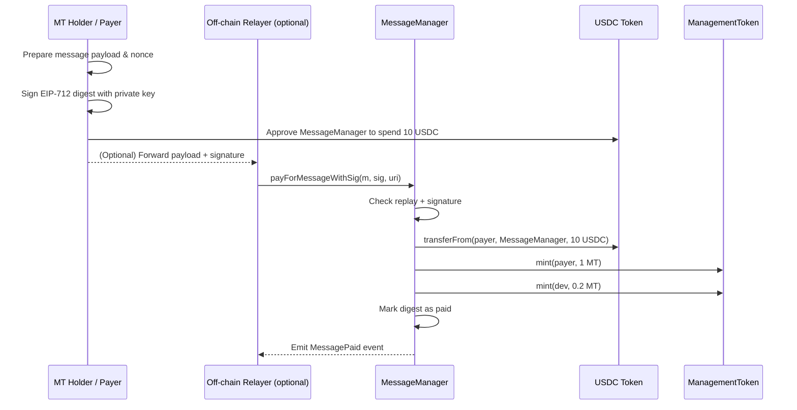

```mermaid
sequenceDiagram
    participant User as MT Holder / Payer
    participant Agent as Off-chain Relayer (optional)
    participant MessageMgr as MessageManager
    participant USDC as USDC Token
    participant MT as ManagementToken

    User->>User: Prepare message payload & nonce
    User->>User: Sign EIP-712 digest with private key
    User->>USDC: Approve MessageManager to spend 10 USDC
    User-->>Agent: (Optional) Forward payload + signature
    Agent->>MessageMgr: payForMessageWithSig(m, sig, uri)
    MessageMgr->>MessageMgr: Check replay + signature
    MessageMgr->>USDC: transferFrom(payer, MessageManager, 10 USDC)
    MessageMgr->>MT: mint(payer, 1 MT)
    MessageMgr->>MT: mint(dev, 0.2 MT)
    MessageMgr->>MessageMgr: Mark digest as paid
    MessageMgr-->>Agent: Emit MessagePaid event
```
