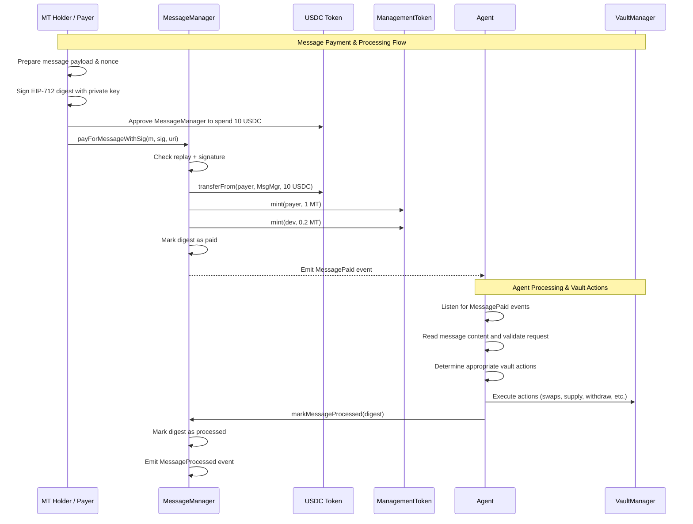

```mermaid
sequenceDiagram
    participant User as MT Holder / Payer
    participant MessageMgr as MessageManager
    participant USDC as USDC Token
    participant MT as ManagementToken
    participant Agent
    participant VaultMgr as VaultManager

    Note over User, VaultMgr: Message Payment & Processing Flow

    User->>User: Prepare message payload & nonce
    User->>User: Sign EIP-712 digest with private key
    User->>USDC: Approve MessageManager to spend 10 USDC
    User->>MessageMgr: payForMessageWithSig(m, sig, uri)
    MessageMgr->>MessageMgr: Check replay + signature
    MessageMgr->>USDC: transferFrom(payer, MsgMgr, 10 USDC)
    MessageMgr->>MT: mint(payer, 1 MT)
    MessageMgr->>MT: mint(dev, 0.2 MT)
    MessageMgr->>MessageMgr: Mark digest as paid
    MessageMgr-->>Agent: Emit MessagePaid event

    Note over Agent, VaultMgr: Agent Processing & Vault Actions

    Agent->>Agent: Listen for MessagePaid events
    Agent->>Agent: Read message content and validate request
    Agent->>Agent: Determine appropriate vault actions
    Agent->>VaultMgr: Execute actions (swaps, supply, withdraw, etc.)
    Agent->>MessageMgr: markMessageProcessed(digest)
    MessageMgr->>MessageMgr: Mark digest as processed
    MessageMgr->>MessageMgr: Emit MessageProcessed event
```
