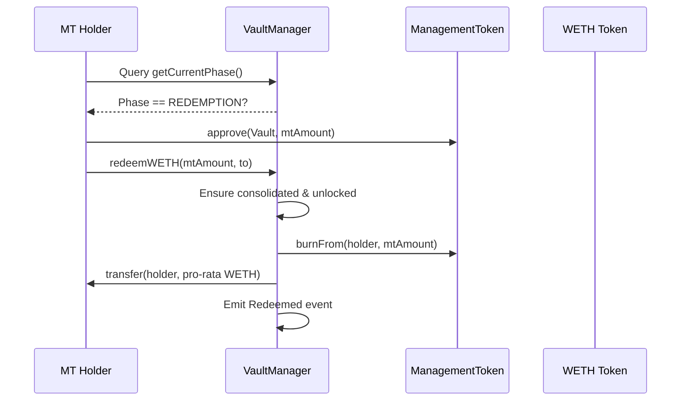

```mermaid
sequenceDiagram
    participant Holder as MT Holder
    participant Vault as VaultManager
    participant MT as ManagementToken
    participant WETH as WETH Token

    Holder->>Vault: Query getCurrentPhase()
    Vault-->>Holder: Phase == REDEMPTION?
    Holder->>MT: approve(Vault, mtAmount)
    Holder->>Vault: redeemWETH(mtAmount, to)
    Vault->>Vault: Ensure consolidated & unlocked
    Vault->>MT: burnFrom(holder, mtAmount)
    Vault->>Holder: transfer(holder, pro-rata WETH)
    Vault->>Vault: Emit Redeemed event
```
