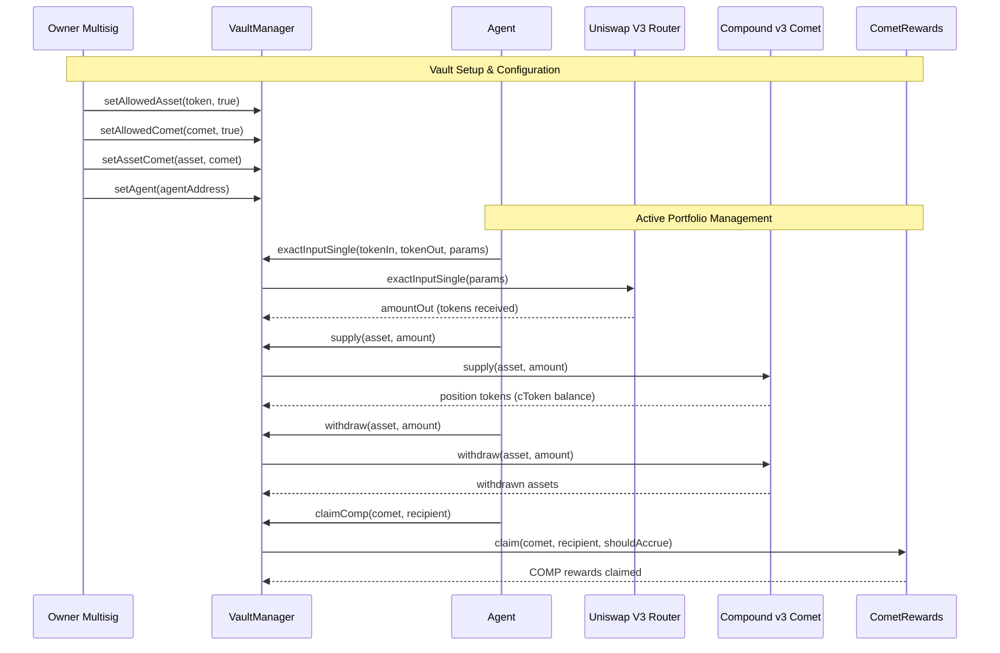

```mermaid
sequenceDiagram
    participant Owner as Owner Multisig
    participant VaultMgr as VaultManager
    participant Agent
    participant UniswapV3 as Uniswap V3 Router
    participant Comet as Compound v3 Comet
    participant CometRewards as CometRewards

    Note over Owner, CometRewards: Vault Setup & Configuration

    Owner->>VaultMgr: setAllowedAsset(token, true)
    Owner->>VaultMgr: setAllowedComet(comet, true)
    Owner->>VaultMgr: setAssetComet(asset, comet)
    Owner->>VaultMgr: setAgent(agentAddress)

    Note over Agent, CometRewards: Active Portfolio Management

    Agent->>VaultMgr: exactInputSingle(tokenIn, tokenOut, params)
    VaultMgr->>UniswapV3: exactInputSingle(params)
    UniswapV3-->>VaultMgr: amountOut (tokens received)

    Agent->>VaultMgr: supply(asset, amount)
    VaultMgr->>Comet: supply(asset, amount)
    Comet-->>VaultMgr: position tokens (cToken balance)

    Agent->>VaultMgr: withdraw(asset, amount)
    VaultMgr->>Comet: withdraw(asset, amount)
    Comet-->>VaultMgr: withdrawn assets

    Agent->>VaultMgr: claimComp(comet, recipient)
    VaultMgr->>CometRewards: claim(comet, recipient, shouldAccrue)
    CometRewards-->>VaultMgr: COMP rewards claimed
```
